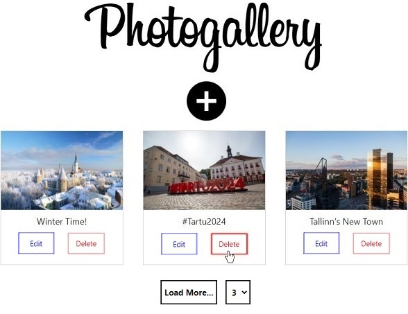

# PhotoGallery
This application was created to support students with the creation of a single-page application (SPA). It manages photos from the web with these technologies:
- [React](https://reactjs.org/) for client-side code
- [Node.js](https://nodejs.org/en/) as the JavaScript runtime environment
- [Docker](https://www.docker.com/) for the container build
- [CSS](https://www.w3.org/TR/CSS/#css) (layout and styling)

 

## References
Based on the Udemy course for ReactJS that I've completed[^1]
 
You can use the official [Microsoft documentation](https://docs.microsoft.com/en-us/visualstudio/containers/container-tools-react?view=vs-2019) to run Docker on your machine
[^1]: The Complete ReactJS & Redux Course
